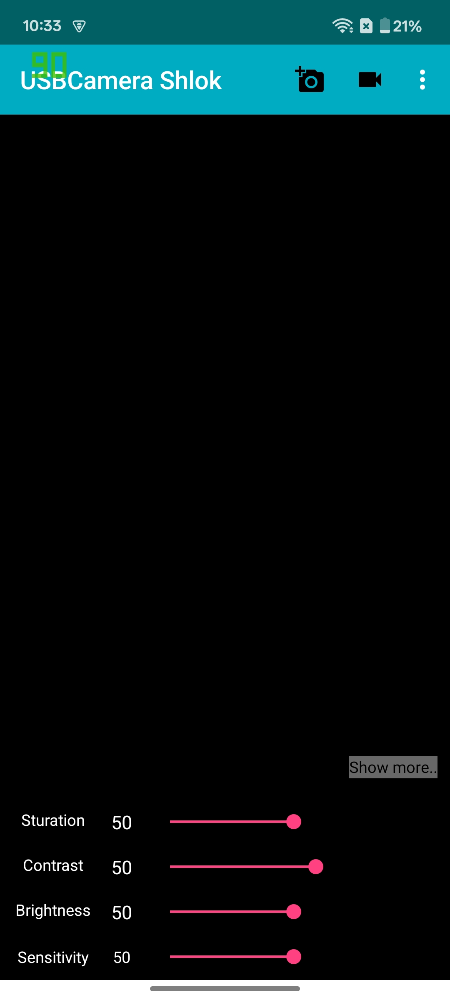
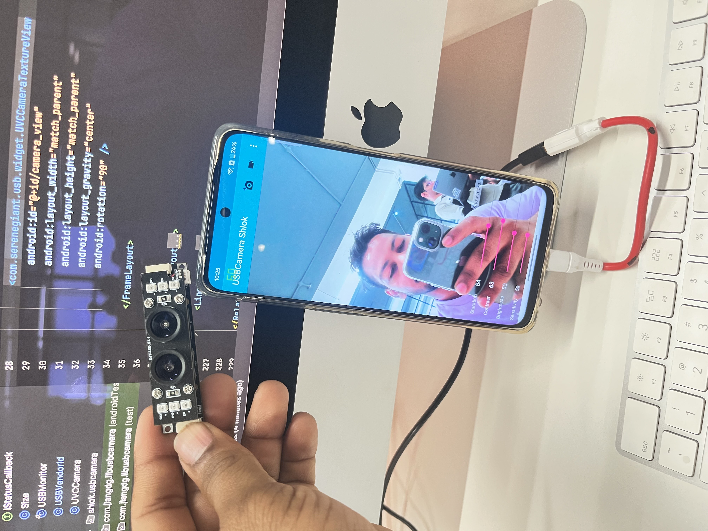
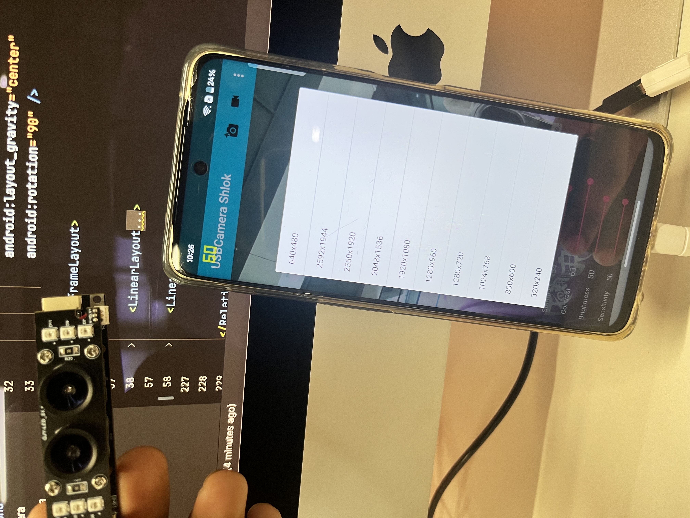
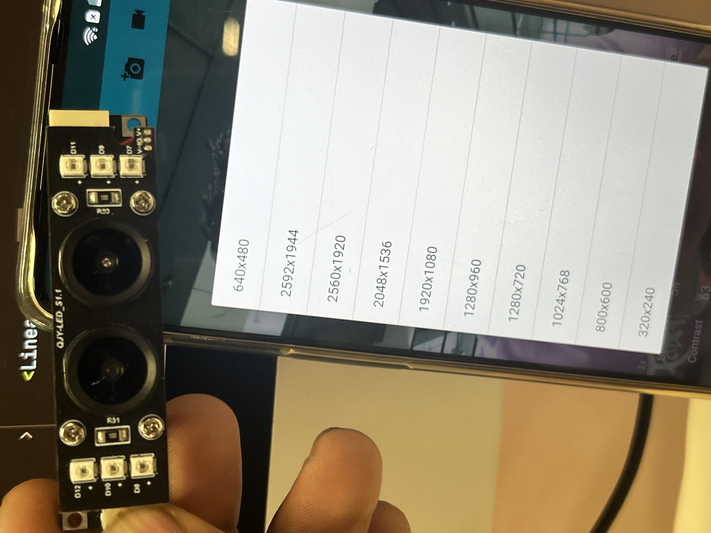
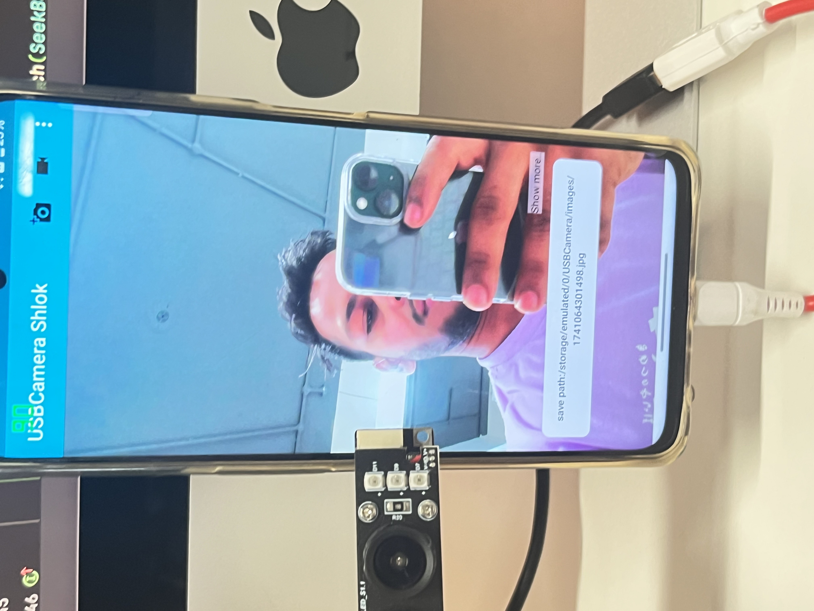

# 📸 Android USB Camera Library

A simple Android library to connect and control USB cameras (UVC devices). Perfect for adding camera features to your app!

---

## 🌟 Features
✅ Auto-detect USB cameras  
✅ Take photos (JPG) & record videos (MP4)  
✅ Adjust camera settings (brightness/contrast)  
✅ Multiple video formats: H.264, AAC, YUV  
✅ Time overlays in recordings (ARM devices)  
✅ Works on Android 5.0+ (Lollipop to Android 10)  

---

## 🚀 Quick Setup

### 1️⃣ Add to Your Project

Add these to your **project-level** `build.gradle`:

```groovy
allprojects {
    repositories {
        maven { url 'https://raw.github.com/saki4510t/libcommon/master/repository/' }
        maven { url 'https://jitpack.io' }
    }
}
```

Add this to your **app-level** `build.gradle`:

```groovy
dependencies {
    implementation 'com.github.jiangdongguo:AndroidUSBCamera:2.3.4'
}
```

### 2️⃣ Important Notes
📱 **Android 10 Users**: Set `targetSdkVersion` to **27** in `build.gradle`

🔌 **Requires OTG-supported device**

🛠 **Use Gradle 6.x (not 7+)**

🛠 **To run this project, downgrade the Gradle JDK to 11**

---

## 🛠 Basic Usage

### 🔹 Initialize Camera

```java
// In your Activity/Fragment
mUVCCameraView = (CameraViewInterface) textureView;
mCameraHelper = UVCCameraHelper.getInstance();
mCameraHelper.initUSBMonitor(this, mUVCCameraView, connectionListener);

// Set default resolution
mCameraHelper.setDefaultPreviewSize(1280, 720);
```

### 📸 Take Photo

```java
mCameraHelper.capturePicture("/sdcard/photo.jpg", path -> {
    Log.d("Camera", "Photo saved: " + path);
});
```

### 🎥 Record Video

```java
RecordParams params = new RecordParams();
params.setRecordPath("/sdcard/video.mp4");
params.setVoiceClose(true); // Mute microphone

mCameraHelper.startPusher(params, (data, type) -> {
    // type 1 = video, type 0 = audio
});
```

---

## 🔧 Common Fixes

### Camera Not Showing? Try:

✅ **Check OTG support**  
✅ **Switch video format:**

```java
mCameraHelper.setDefaultFrameFormat(UVCCameraHelper.FRAME_FORMAT_YUYV);
```
✅ **Look for `failed-device.txt` in device storage**  
✅ **Set `targetSdkVersion` 27 in `build.gradle`**  

---

### 🖼️ Attach Images
To attach images captured from the USB camera to your UI:

<p align="center">
    
    
    
    
    
</p>

---

## 📱 Demo App

Download the demo app to test features before implementing:  
[🔗 USB Camera Demo App](https://github.com/Shlok-Android-Dev/USB-Camera/tree/main/app/release)

---

## 🤝 Contributing
Pull requests are welcome! For major changes, please open an issue first to discuss what you would like to change.
